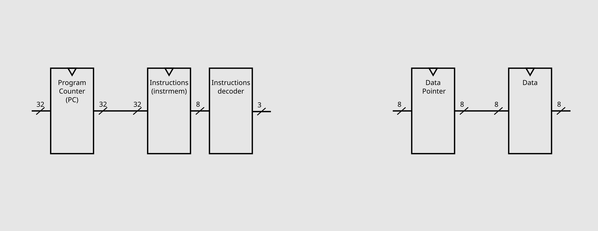
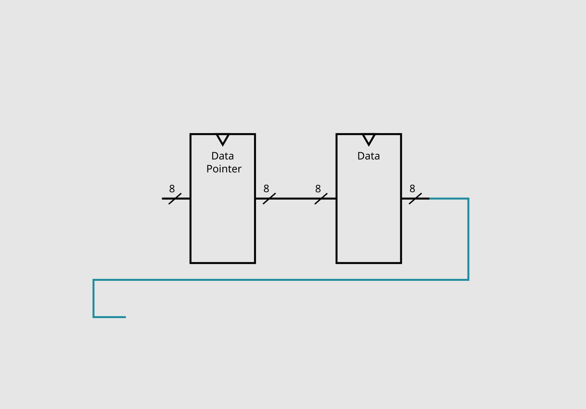
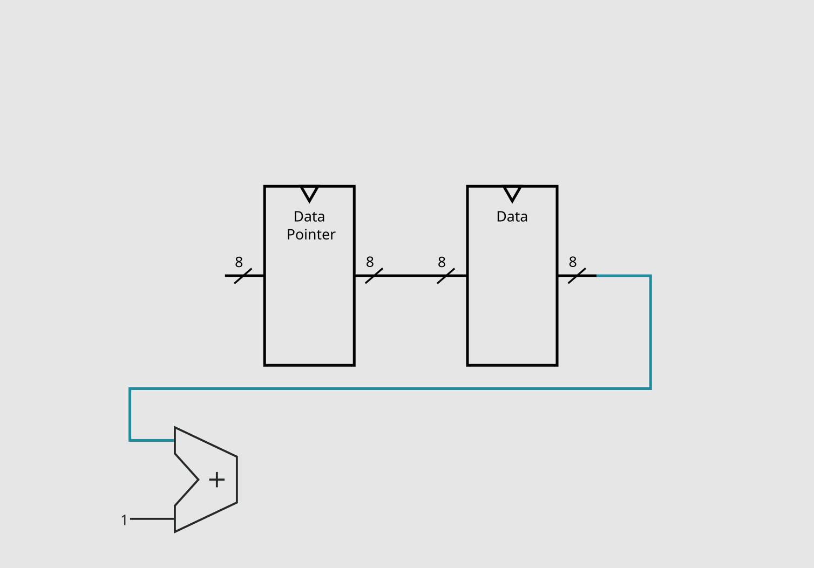
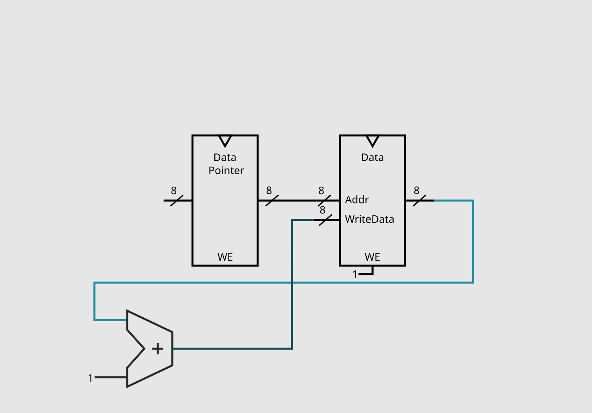
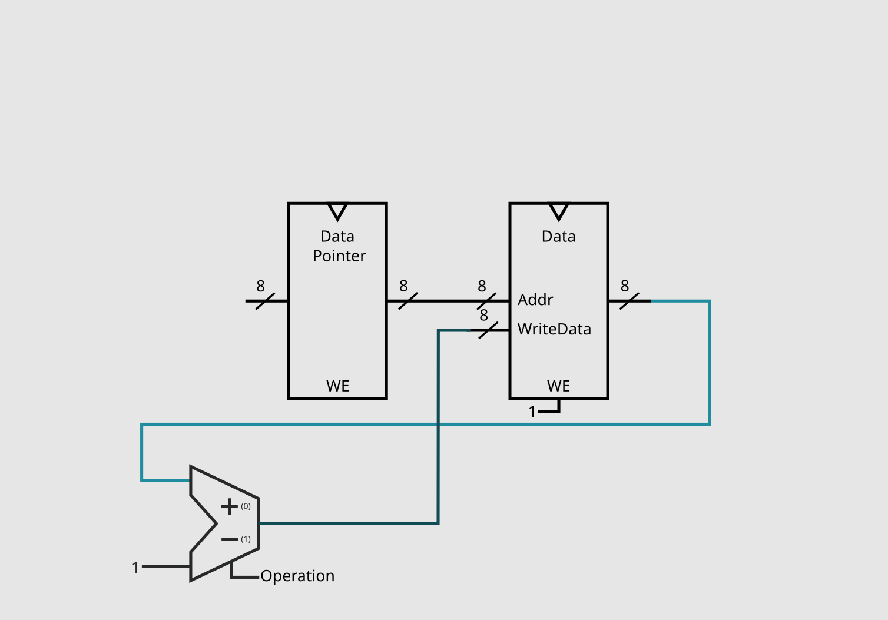
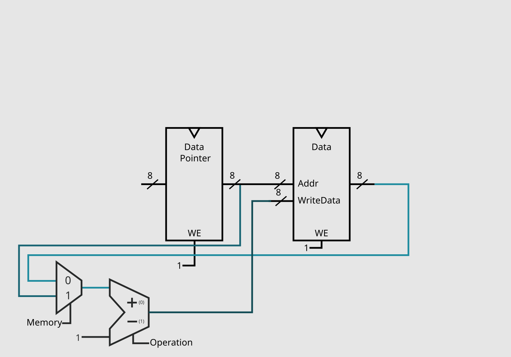
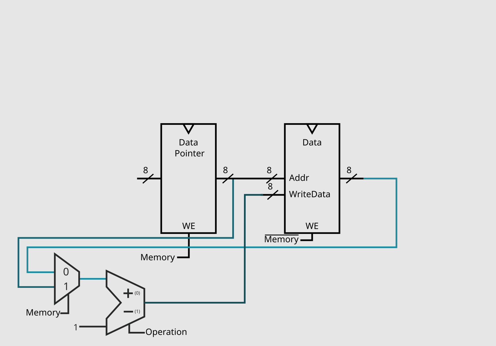
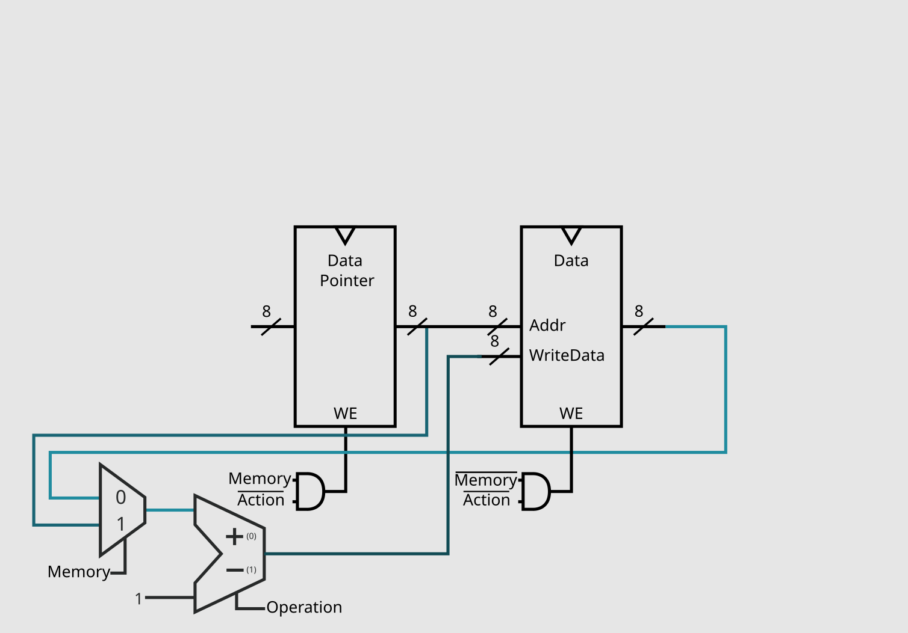
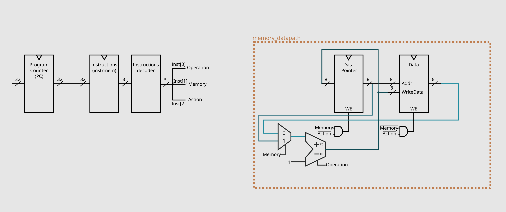

+++
title = "Brainf*ck Processor - The Beginning"
date = 2023-08-12
transparent = true

[extra]
read_time_minutes = "10 min"
+++

Hello to whoever comes across this post! This is an article documenting the development process
of one of my latest projects, a [brainf\*ck processor](https://github.com/loco-choco/bf-processor/)!

## What? Why?

Yes, you heard me right, this is a processor that uses the esoteric programming language [brainf\*ck](https://en.wikipedia.org/wiki/Brainfuck) 
as its architecture. This is the same as saying that, instead of this microprocessor being a [risc-v](https://en.wikipedia.org/wiki/RISC-V),
[mips](https://en.wikipedia.org/wiki/MIPS_architecture) or [x86](https://en.wikipedia.org/wiki/X86), it will use the ASCII characters
from BF as its *binary assembly*.

Why am I doing this? For the fun of it, and in the similar vain of the interpreters of this language that try to be
as small as possible, I wanted to see what happens when you limit your architecture to only have *8 different instructions*, plus
I was curious how I would end up implementing the IO commands.

## Brainf\*ck

I am gonna give a small recap about how this language works, and the important bits that matter for this project.
This esoteric language is composed of 8 different commands, here are them in a table that was totally not taken from 
the [pt wikipedia article](https://pt.wikipedia.org/wiki/Brainfuck#Comandos).

| Command |            What it does           |      C equivalent      |
|:-------:|:---------------------------------:|:----------------------:|
|    +    |  Increases by 1 the value of data |      data[ptr]++;      |
|    -    |  Decreases by 1 the value of data |      data[ptr]--;      |
|    >    |  Increases by 1 the value of ptr  |         ptr++;         |
|    <    |  Decreases by 1 the value of ptr  |         ptr--;         |
|    .    | Outputs the current value of data |   putchar(data[ptr]);  |
|    ,    | Receives input and overrides data | data[ptr] = getchar(); |
|    [    |   Enters loop if data isn't zero  |    while(data[ptr]){   |
|    ]    |     Exits loop if data is zero    |            }           |

Something to take note is how all the commands are related to change the `ptr` (data pointer) and the current position on 
the `data` vector, this will be important on the next section. Also, on the specification, both `ptr` and `data[ptr]` are
8 bits, and then rollover if you try to decrement from 0 or increment from 255.

## The Adventure Begins



Most of the ideas I will talk here come from the 2nd edition of "Digital Design and Computer Architecture" from David Money Harris 
and Sarah L. Harris, up untill the 7.1.2 section, from which I stoped reading and tried to start this project with just
this first insight it gave, so take what I say about microprocessor architecture with a big grain of salt.



To start we need to first look at our instruction set. Because it only has 8 commands, we could decode it down to just 3 bits, which
will help to reduce the number of signals we need to worry about when designing. I decided to decode them in the following manner,
the reason why will make more sense when I talk about how I implemented the first 4 operations:

| Operation | ASCII | Decoded |
|:---------:|:-----:|:-------:|
|     +     |  0x3C |   000   |
|     -     |  0x3E |   001   |
|     >     |  0x2B |   010   |
|     <     |  0x2D |   011   |
|     .     |  0x2E |   110   |
|     ,     |  0x2C |   111   |
|     [     |  0x5B |   100   |
|     ]     |  0x5D |   101   |

So, how do we start designing now? I took inspiration from the "Digital Design and Computer Architecture" book, which mentions
to start with the memory elements of the microprocessor, and then connect/add components to perform what each instruction is
supossed to do. 

We have first the basic two elements, the *program counter* (PC) and the instruction memory (instrmem) element (I had decided to make it with the 
[Harvard architecture](https://en.wikipedia.org/wiki/Harvard_architecture)). The size of the PC will affect how many instructions our
programs can have, I defaulted to 32 bits as it gives plenty of room for anything big. As mentioned, because we want to use the ascii
binary of each operation for the instructions, each word of our instruction memory will need to be 8 bits, and, as the decoded version
of them will make our lifes easier, we can also immediatly place a decoder on the output of instrmem.
These components result on this first schematic of our processor.

Now for the program memory. Instead of just a normal RAM, we need a register to store the DP (data pointer)
and a bank of registers for our data, and as the specs of brainf\*ck mention, both need be 8 bits in size.

Now that we have these first parts layed out, we can start to implement some operations. The next sections will be organized 
in chronological order and with the same name as their datapath in code.

## Implementing the Memory Datapath

I first decided to start with the +, -, > and < instructions, as their effects on the current system were most obvious.

### Adding '+'

For the + operation we need to:
1. get the current value of data
2. get the value of data + 1
3. store that value back to data

The first step is easy, we just need to grab the current output of the registry bank.

Then, for step 2, we need to figure out the value of data + 1, which, as you might expect, can be determined with an
[adder](https://en.wikipedia.org/wiki/Adder_(electronics)).

Now we just need to store the result, which means we just need to feed it back to the bank of registers and set the WriteEnable
pin.

You might have now noticed that there are no control pins on our current circuit, and don't worry, they will appear soon.
I find it better to only add these control signals once there is another instruction that needs to also use the same component
but in a different manner (like our adder in the next subsection), or, in the end, when only a single set of components use 
said component, so you better deactivate it when they aren't being executed.

### Adding '-'

Now, for - we need to do the same as +, but getting the value of data - 1. This is fairly straight foward with our current
circuit, we only need to replace our simple adder with an [adder-subtractor](https://en.wikipedia.org/wiki/Adder%E2%80%93subtractor)
and add our first control pin, which will be called "Operation".

### Adding '>' and '<'

Like + and -, > and < also add and subtract, but with the data pointer. Again, such change isn't too hard, all we need to do
is have a way to choose the input for the adder-subtractor, and that can be achieved with a multiplexer.
As this multiplexer will have 2 inputs and a single output, it only needs a single selection pin, we can call it "Memory" 
(as it chooses which memory element will be operated on).

You might look at this and ask yourself: "Won't this circuit save the output to both DP and the data ?" And the anwser is yes, it will,
but because "Memory = 0" selects the reg bank, and "Memory = 1" the DP, we can just use them in their respective WriteEnable pins.

And that is it! We have implemented our first 4 operations of this microprocessor. As you might have noticed from the choosen binary
for each instruction, the 1's and 0's fit perfectly for this section of circuit.

| Operation | Decoded | Memory | Operation |
|:---------:|:-------:|:------:|:---------:|
|     +     |   000   |   0    |     0     |
|     -     |   001   |   0    |     1     |
|     >     |   010   |   1    |     0     |
|     <     |   011   |   1    |     1     |

So we don't even need to create a control unit for those pins, as decoding and setting the pins correctly does all this job for us!

We can now give actual names for bits of the decoded instruction:

| Operation | ASCII | Action | Memory | Operation |
|:---------:|:-----:|:------:|:------:|:---------:|
|     +     |  0x3C |    0   |   0    |     0     |
|     -     |  0x3E |    0   |   0    |     1     |
|     >     |  0x2B |    0   |   1    |     0     |
|     <     |  0x2D |    0   |   1    |     1     |
|     .     |  0x2E |    1   |   1    |     0     |   
|     ,     |  0x2C |    1   |   1    |     1     |
|     [     |  0x5B |    1   |   0    |     0     |
|     ]     |  0x5D |    1   |   0    |     1     |

This new name, "Action", divides the instructions in two groups:

0. Memory related instructions
1. IO/Jumping related instructions

Which means, that whenever "Action = 1", no operations on both DP and the data should be performed. We can do this by just adding
a and gate with our previous pin on the WriteEnable of both components.

And this finishes our first data path of this project:
[memory_datapath](https://github.com/loco-choco/bf-processor/blob/main/src/memory_datapath.vhd).

This will do for this first post, the making of the rest of the components will be documented on the following posts
